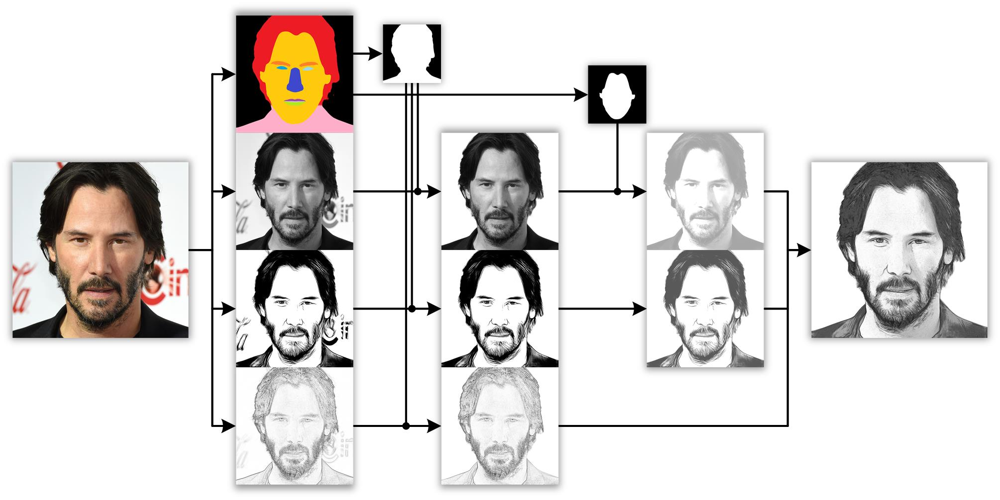

# BiDiE_FG2024
Official code for paper: Multi-View Consistent 3D GAN Inversion via ***Bidi***rectional ***E***ncoder (The 18th IEEE International Conference on Automatic ***F***ace and ***G***esture Recognition)

## Environment
The environment used in this paper: [env.txt](https://github.com/WHZMM/BiDiE/blob/main/environment/env.txt)  
We strongly recommend that you successfully build [EG3D](https://github.com/NVlabs/eg3d) env first, and then build this paper's env based on it.

## Train and test **Bidi**rectional **E**ncoder
Train: [/Bidirectional_Encoder/scripts/train_hybrid.py](https://github.com/WHZMM/BiDiE/blob/main/scripts/train_hybrid.py)  
Test Single-View Reconstruction: [/Bidirectional_Encoder/scripts/test_psp20_encode_loop.py](https://github.com/WHZMM/BiDiE/blob/main/scripts/test_psp20_encode_loop.py)  
Test Multi-View Consistency: [/Bidirectional_Encoder/scripts/test_psp20_3D_multi_loop.py](https://github.com/WHZMM/BiDiE/blob/main/scripts/test_psp20_3D_multi_loop.py)

## Sketch Synthesis Algorithm and Synthesized Sketch Dataset
Sketch Synthesis Algorithm: [/Bidirectional_Encoder/gen_sketch](https://github.com/WHZMM/BiDiE/blob/main/gen_sketch) (Please run the code in sequence, from step 1 to 5)  

Synthesized Sketch Dataset: [Sketch-BiDiE](https://drive.google.com/drive/folders/185CkrvyEZsGN4Yyqqv1FQMA4Z-NyTRqt?usp=drive_link) (decompression password: BiDiE-FG2024)  
I've only uploaded 512x512 EG3D-cropped versions, but you can synthesize sketches yourself using my open source algorithm.

## Acknowledgments
This code borrows from: [EG3D](https://github.com/NVlabs/eg3d), [pSp](https://github.com/eladrich/pixel2style2pixel), [e4e](https://github.com/omertov/encoder4editing) ...  
We also thank these open source projects: [U<sup>2</sup>-Net](https://github.com/xuebinqin/U-2-Net), [Facer](https://github.com/FacePerceiver/facer), [Deep3DFaceRecon_pytorch
](https://github.com/sicxu/Deep3DFaceRecon_pytorch), [EG3D-projector](https://github.com/oneThousand1000/EG3D-projector) ...

## Citation
If you use this "***Bidi***rectional ***E***ncoder" / "BiDiE Sketch Dataset" / "BiDiE Sketch Synthesis Algorithm" for your research, please cite our paper
```
@inproceedings{wu_BiDiE_FG2024,
  title={Multi-View Consistent 3D GAN Inversion via Bidirectional Encoder},
  author={Haozhan Wu, Hu Han, Shiguang Shan, Xilin Chen},
  booktitle={The 18th IEEE International Conference on Automatic Face and Gesture Recognition, 2024. Proceedings.},
  pages={???--???},
  year={2024},
  organization={IEEE}
}
```
